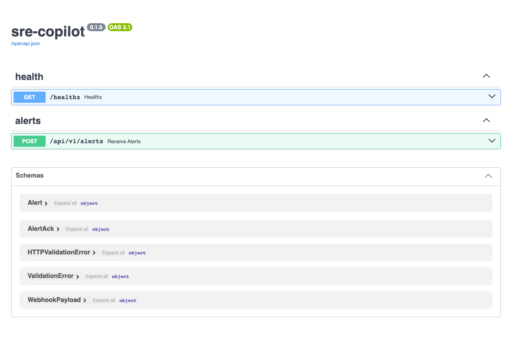
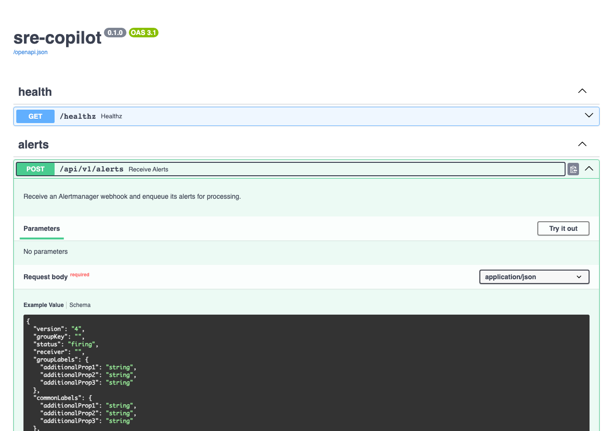
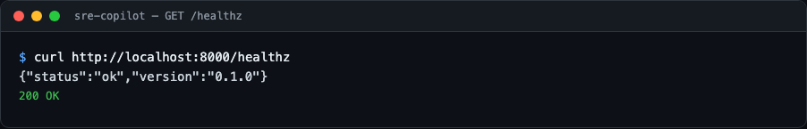
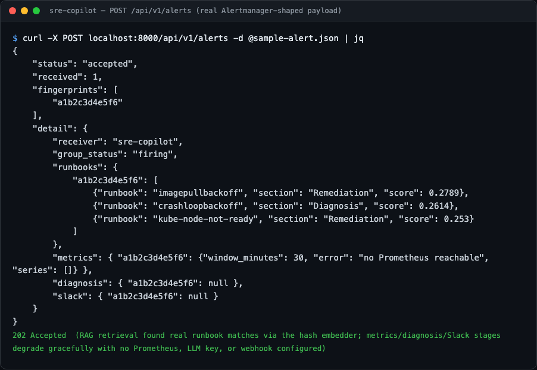
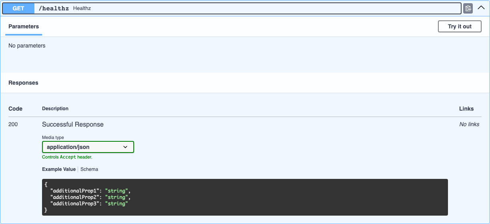
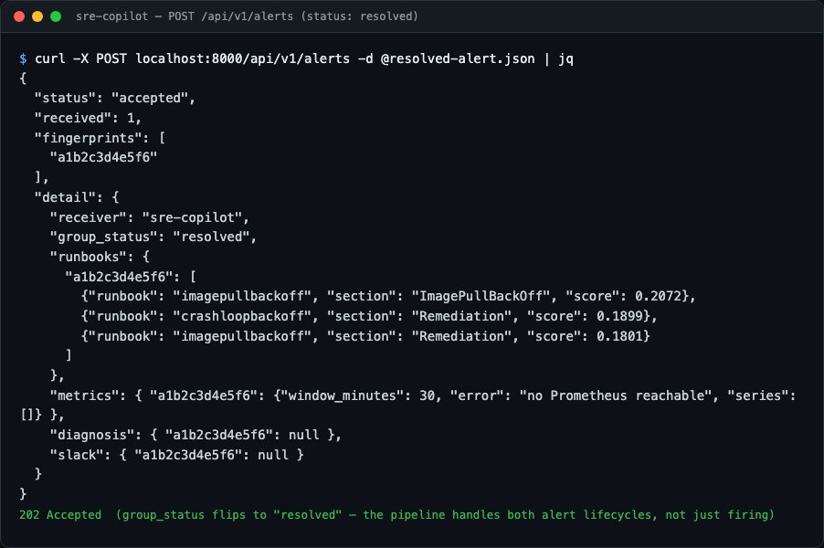

# sre-copilot

An AI on-call assistant for Kubernetes incidents. It ingests Prometheus
Alertmanager alerts via webhook, retrieves matching runbooks with a RAG
pipeline (ChromaDB + embeddings), correlates with recent metrics, and posts a
diagnosis plus suggested remediation steps to Slack.

## Preview

The interactive API docs FastAPI generates automatically:



<details>
<summary>More views</summary>











</details>

## Project Status

**In active development** — built in public, one phase per night.
See [PROGRESS.md](PROGRESS.md) for the vision, architecture, phased build
plan, and the current resume point.

Current phase: **Phase 5 — Slack Notification** ✅

## Stack

- FastAPI + Pydantic v2 (backend, typed config)
- ChromaDB + sentence-transformers (runbook RAG)
- Prometheus HTTP API (metrics correlation)
- Pluggable LLM client, fully mocked in tests
- Slack Block Kit notifications
- Helm chart deployment

## Quickstart (dev)

```bash
python3 -m venv .venv && source .venv/bin/activate
pip install -e '.[dev]'
pytest
uvicorn sre_copilot.main:app --reload
```

Endpoints so far:

- `GET /healthz` — liveness probe
- `POST /api/v1/alerts` — Alertmanager webhook receiver; each accepted alert
  is matched against the runbook index, correlated with recent Prometheus
  metrics, diagnosed by the LLM stage, and posted to Slack. The response
  `detail.runbooks` carries the top-k excerpts (runbook, section, similarity
  score), `detail.metrics` a per-series summary (name, point count, latest
  value), `detail.diagnosis` the structured diagnosis (likely cause,
  confidence, remediation steps), and `detail.slack` the delivery status
  (`{"delivered": true|false}`) — each `null` when its stage is disabled

## Runbook RAG

Markdown runbooks live in [`runbooks/`](runbooks/) (CrashLoopBackOff,
OOMKilled, ImagePullBackOff, high CPU, node NotReady). At startup they are
chunked by section and indexed into a persistent ChromaDB collection
(`SRE_COPILOT_CHROMA_PERSIST_DIR`, default `.chroma/`).

Embedding backend is selectable via `SRE_COPILOT_EMBEDDING_BACKEND`:

- `hash` (default) — deterministic hashing embedder, no model download,
  works offline; used in tests
- `sentence-transformers` — real local embeddings (`SRE_COPILOT_EMBEDDING_MODEL`,
  default `all-MiniLM-L6-v2`)

Retrieval fan-out per alert is controlled by `SRE_COPILOT_RETRIEVAL_TOP_K`
(default 3).

## Metrics correlation

Each alert is correlated with recent Prometheus metrics
(`src/sre_copilot/metrics/`): the correlator builds a PromQL label selector
from the alert's `namespace`/`pod`/`container` labels and runs range queries
for CPU usage, working-set memory, and container restarts over a trailing
window.

Settings:

- `SRE_COPILOT_PROMETHEUS_URL` — base URL of the Prometheus HTTP API
  (default `http://prometheus:9090`); set empty to disable correlation
- `SRE_COPILOT_PROMETHEUS_TIMEOUT_SECONDS` (default 5)
- `SRE_COPILOT_METRICS_WINDOW_MINUTES` (default 30) and
  `SRE_COPILOT_METRICS_STEP_SECONDS` (default 60) — query window and resolution

Correlation degrades gracefully: alerts without identifying labels skip the
queries, and an unreachable Prometheus yields an empty snapshot with the error
recorded — the webhook ack is never blocked by a Prometheus outage.

## LLM diagnosis

Each alert is diagnosed by an LLM stage (`src/sre_copilot/llm/`): a prompt
builder assembles the alert, its runbook excerpts and its metrics summary,
and a provider-agnostic chat client (`OpenAICompatibleClient`, any
OpenAI-compatible `/chat/completions` API in JSON mode) returns a structured
`Diagnosis` — likely cause, confidence (`low`/`medium`/`high`) and ordered
remediation steps, validated against a Pydantic schema.

Settings:

- `SRE_COPILOT_LLM_API_KEY` — unset/empty disables the diagnosis stage
  entirely (default)
- `SRE_COPILOT_LLM_MODEL` (default `gpt-4o-mini`),
  `SRE_COPILOT_LLM_BASE_URL` (default `https://api.openai.com/v1`) and
  `SRE_COPILOT_LLM_TIMEOUT_SECONDS` (default 30)

Like the other stages, diagnosis degrades gracefully: an LLM or response
validation failure is logged and recorded as "no diagnosis" — the alert is
still accepted and queued. Tests use a fake client implementing the
`LLMClient` protocol; no live LLM calls in CI.

## Slack notification

The final pipeline stage (`src/sre_copilot/slack/`) posts one Block Kit
message per alert to a Slack incoming webhook: a color-coded attachment
(severity sidebar: `danger` for critical, `warning` for warning, `good` for
resolved), a header with status and alertname, a context line (severity,
namespace, pod, fingerprint), the alert summary, the LLM diagnosis with
numbered remediation steps, the top runbook excerpt, and the metrics summary.
Every piece degrades to an explicit fallback sentence when its stage is
disabled or failed.

Settings:

- `SRE_COPILOT_SLACK_WEBHOOK_URL` — unset/empty disables the stage entirely
  (default)
- `SRE_COPILOT_SLACK_TIMEOUT_SECONDS` (default 5)

A failed delivery is logged and recorded per fingerprint
(`detail.slack.delivered: false`) — the alert is still accepted and queued.
Tests mock the webhook with `httpx.MockTransport`; no live Slack calls in CI.
